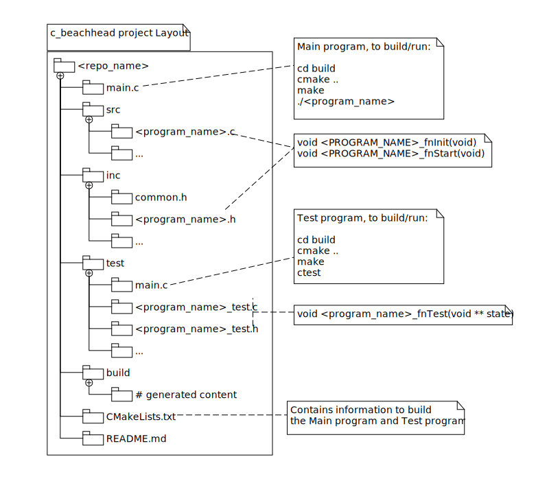

# The C Beachhead

Quickly turn on a WSL2 C programming project and then use "VS Code" in Windows 11
to develop, build and debug it. (Turn "VS Code" into a C IDE for Linux while it
runs on Windows 11)

The project offers the following commands:

```bash
# Log into your WSL Linux distribution and run the commands
# in your preferred shell

# Get help
try --help

# Create "VS Code" config and boilerplate C and test code
# After this command is run "VC Code" can act as an IDE
try new <c_project>

# Build your project (using CMake/Make)
try build

# Run your tests using CMake/CMocka
try tests

# Run "VS Code" in Windows 11
# "VS Code" can build using the WSL CMake/Make files
# "VS Code" can build and run your tests
# "VS Code" can debug the C or tests using GDB running in Linux
code .

# Remove all python and the "try" command
# Overwrite your README.md file with things related to your project
# The following things are NOT removed by this command:
#   - C/H files
#   - C/H test files
#   - CMake/Make files
try remove
```

This is what you will have after you have landed your C beachhead: 



To use this project follow these steps (detailed instructions available in the Quick Start section):

- Install prerequisites in the WSL2 and in "VS Code" (see next section)
- Use this template repo to create your own repo
- Clone your repo onto your machine
- Setup a Python environment
- Run a command provided by the Python environment to create a C environment that "VS Code" can work with in Windows 11.
- Open "VS Code" in Windows 11
- Confirm your C environment is working
- Run tests and confirm they fail
- Fix the test and confirm a pass
- Use your "VS Code" as a C IDE for the WSL2
- Optionally remove the Python environment, leaving only C and the Cmake infrastructure.

## Environment Prerequisites

Packages needed in the [WSL2](https://www.youtube.com/watch?v=Rzg144v3hfo) in Ubuntu (v22.0.4):

```bash
sudo apt update
sudo apt install build-essential  # installs gcc, gcc+ and make
sudo apt install gdb # a C debugger that "VS Code" will use from windows 11
sudo apt install cmake # portable make
sudo apt-get install libcmocka-dev # Sambda's CMocka C testing framework
```

[VS Code](https://code.visualstudio.com/download) (v1.78.2) extensions that were used while building this tool:

- C/C++ v1.15.4 (microsoft)
- C/C++ Extension Pack v1.3.0 (microsoft)
- CMake v0.0.17, Extension Pack v1.3.0 (microsoft)
- CMake Tools v1.14.31
- Makefile Tools v0.7.0 (microsoft)
- Markdown Preview Enhanced v0.6.8

**Note:** All of the above tools were enabled on ``WSL: Ubuntu-22.0.4``

## Quick Start

After you have clicked on "Use this template", you will select a ``<repo_name>``
for your derived repo.

```bash
# Clone your repo onto your machine
git clone git@github.com:aleph2c/<repo_name>.git
cd <repo_name>

# Setup a Python environment
python3 -m venv .venv
source .venv/bin/activate
pip install -e .

# Run a command provided by the Python environment to create a C environment
# that "VS Code" will be able to work with in Windows 11
try new <program_name>
```

The above command will create:
- ``main.c``
- ``/src/<program_name>.c``
- ``/inc/<program_name>.h``
- ``/inc/common.h``
- ``/test/main.c``
- ``/test/<program_name>_test.c``
- ``/test/<program_name>_test.h``
- ``CMakeLists.txt`` configured to create ``<project_name>``
- ``.vscode/`` directory with all of the configuration files required for "VS Code" (running on Windows 11) to build and debug your C programs within the WSL.

---

Open "VS Code" in Windows 11

```bash
code .
```

Try the build and debug features, try changing a file and rebuilding.

---

To build from the command line:

```
try build
```

This will run the following in the ``./build`` directory:

- ``cmake ..`` if it hasn't been run before,
- then it will run ``make``

You can manually run these commands in the same directory to see the same
results.

---

To test your code:

```
try tests
```

This will run the following in the ``./build`` directory:

- ``cmake ..`` if it hasn't been run before,
- then it will run ``make``
- ``ctest --output-on-failure``

You can manually run these commands in the same directory to see the same
results.

---

**Optional**:

Once you are happy with your "VS Code" integration, you can remove the Python
Environment and it's helper commands to only leave the C project.

```bash
# Remove the Python Environment 
try remove
```

The above command will also over-write this boiler-plate README.md file with
something that will work for your C project.

## A Deeper Look

This project uses the `click` Python command library to create a command called `try`. 

The `try new <program_name>` command, creates a new WSL C
project by generating the following:

- `.vscode/tasks.json`: Configures the `make`, `cmake`, and `C/C++: gcc build active file` tasks, which are necessary for creating the executable.
- `.vscode/launch.json`: Configures "VS Code" to utilize the gdb debugger within the WSL.
- `.vscode/c_cpp_properties.json`: Configures the settings for C and C++ IntelliSense and browsing in "VS Code".
- `/build/`: Contains the executables.
- `main.c`: Contains the main C file.
- `/src/<program_name>.c`: A skeleton for your business logic.
- `/inc/<program_name>.h`: Contains the public header for your ``<program_name>.c`` file.
- `/test/main.c`: Contains the main C test file.
- `/test/<program_name>_test.c`: A skeleton for your test logic.
- `/inc/<program_name>_test.h`: Contains the public header for your tests.
- `CMakeLists.txt`: Contains the CMake instructions used to build the project and build the test project.

As you build up your C project, you would add additional C files in ``./src`` with their matching headers in ``./inc``.  Your associated test files would go into ``./test``, and you would have to manually adjust the ``./main.c`` and ``./tests/main.c`` to include your new business logic and tests.
